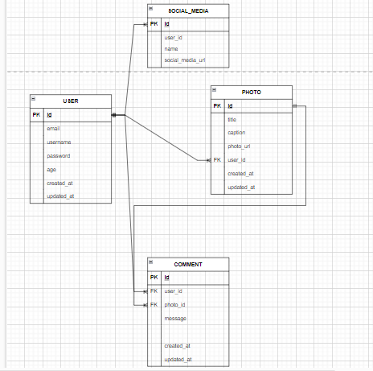

# Final Project 2

## Database Diagram


## End Points
### Users
- <b><i>/users/register</b></i> [POST]

    body = 
    ```
    {
        "age": 20,
        "email": "gian@gmail.com",
        "password": "password123",
        "username": "gianpganz"
    }
    ```
    <b>Response: </b>
    ```
    code: 201
    {
        "age": 20,
        "email": "gian@gmail.com",
        "id": 1,
        "username": "gianpganz"
    }
    ```
- <b><i>/users/login</b></i>    [POST]
    ```
    {
        "email": "gian@gmail.com",
        "password": "password123",  
    }
    ```
    <b>Response: </b>
    ```
    code : 200
    {
        "token": "jbwhduhd21e8ey31e128ye818A"
    }
    ```
- <b><i>/users/</b></i>         [PUT]
    ```
    code : 200
    {
        "id": 1,
        "email": "gian@gmail.com",
        "username": "gianpganz",
        "age": 20,
        "updated_at": "20-06-2023"
    }
    ```
